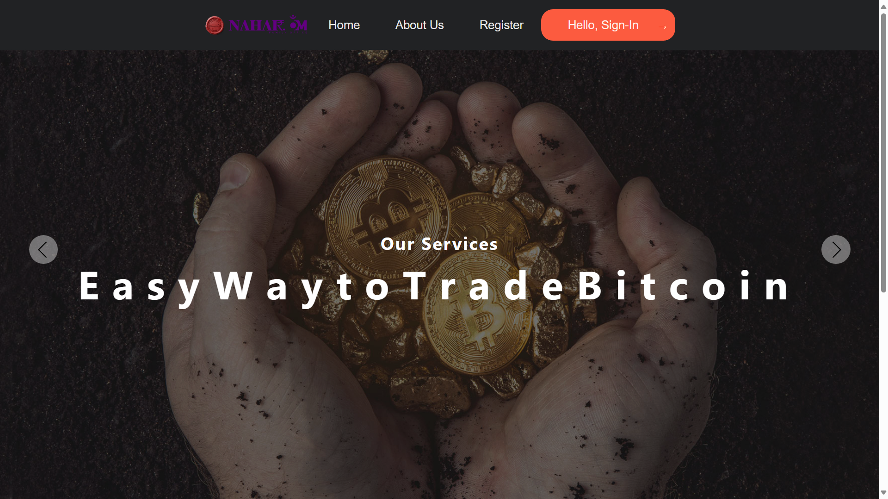
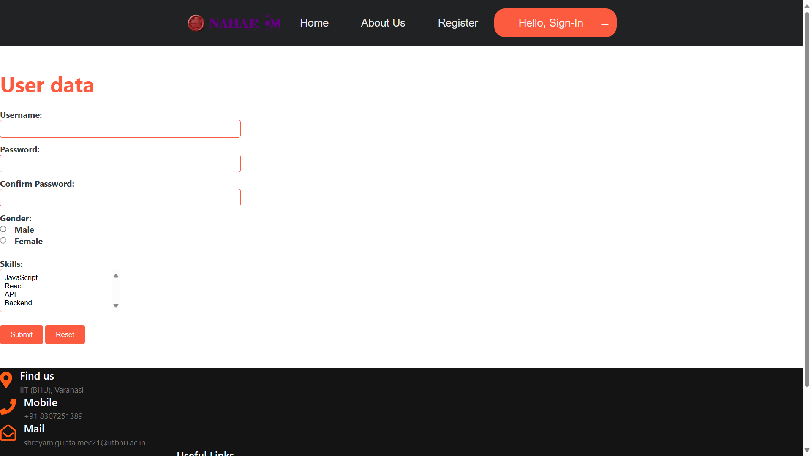
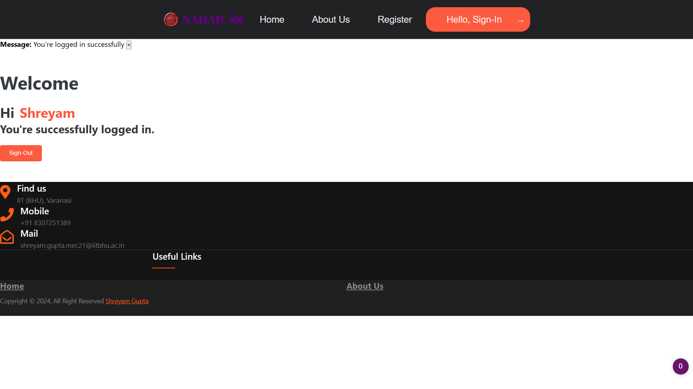
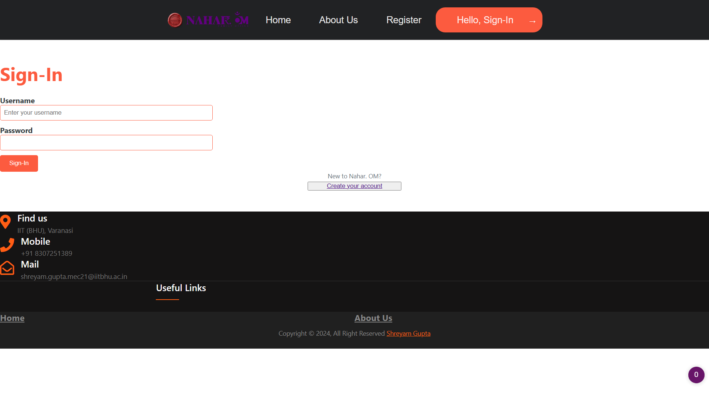
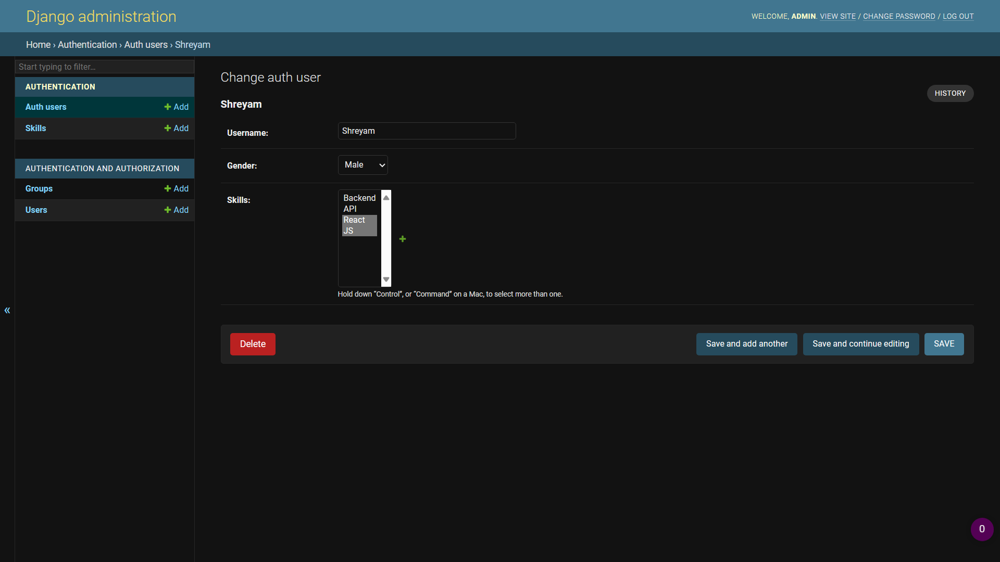

## Frontend/Backend Task-1 -> Django/React 
> This is a **Fullstack** implementation of an User collection and Skill management website,  created using **Django/React** Frameworks.

## Brief Instructions
* Start your virtual environment by running:  
`myvenv\Scripts\activate`
* Start the web server by running:  
`python manage.py runserver`
* In browser enter this address:  
`http://127.0.0.1:8000/`
---

---

---

---

---

---
